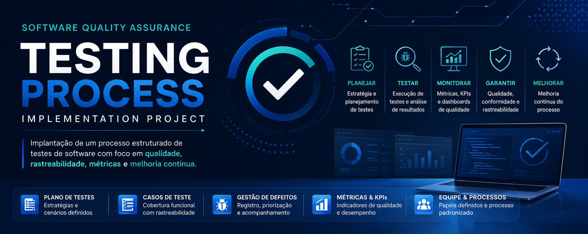

# 🚀 Software Quality Assurance Project

Projeto de implantação de processo estruturado de testes de software.

---

# 📌 Objetivo

Estruturar um processo completo de QA com foco em:

- Qualidade
- Rastreabilidade
- Gestão de Defeitos
- Cobertura de Testes
- Redução de Falhas
- Melhoria Contínua

---

# 🧠 Conceitos Aplicados

- QA (Quality Assurance)
- STLC
- SDLC
- Plano de Testes
- Casos de Teste
- Gestão de Riscos
- Métricas de Qualidade
- KPIs
- Gestão de Projetos

---

# 🛠 Ferramentas Utilizadas

- Jira
- Azure DevOps
- Selenium
- Cypress
- Postman
- GitHub
- Power BI
- Miro
- Draw.io

---

# 👩‍💻 Meu Papel no Projeto

Atuei como:

- QA Analyst
- Product Owner
- Analista de Sistemas
- Responsável pela documentação
- Responsável pelo processo de testes
- Responsável pelo levantamento de requisitos

---

# 📂 Estrutura do Projeto

```bash
docs/
images/
artifacts/
```

---

# 📈 Resultados Esperados

- Redução de defeitos em produção
- Padronização do processo QA
- Maior cobertura de testes
- Redução de retrabalho
- Maior rastreabilidade

---

# 📎 Documentação

A documentação completa está disponível na pasta `/docs`.
